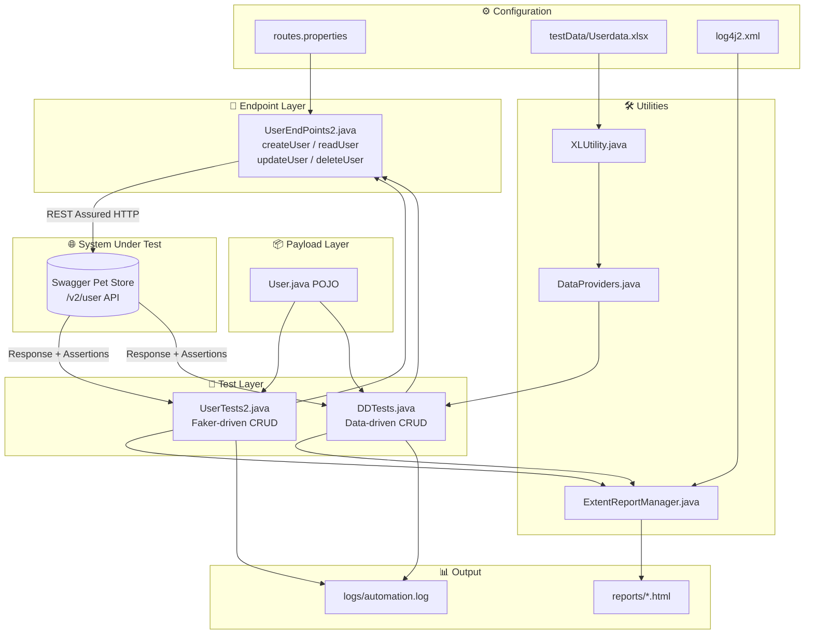
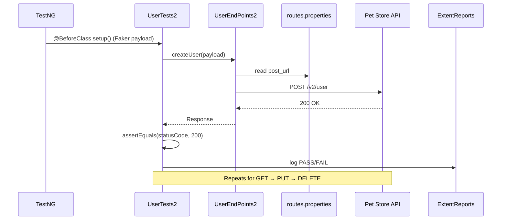

# 🐾 Pet Store API Automation Framework — REST Assured

[](https://www.oracle.com/java/)
[](https://maven.apache.org/)
[](https://rest-assured.io/)
[](https://testng.org/)
[](https://www.extentreports.com/)
[](https://logging.apache.org/log4j/2.x/)
[](#prerequisites)
[](#license)
[](#how-to-run-tests)

> A clean, layered API test automation framework that validates the **Swagger Pet Store `/user` API** (Create → Read → Update → Delete) using **REST Assured**, **TestNG**, **data-driven testing**, rich **ExtentReports**, and structured **Log4j2** logging.

---

## 📑 Table of Contents

1. [Overview](#-overview)
2. [Tech Stack](#-tech-stack)
3. [Architecture Diagram](#-architecture-diagram)
4. [Prerequisites](#-prerequisites)
5. [Quick Start](#-quick-start)
6. [How to Run Tests](#-how-to-run-tests)
7. [Folder Structure](#-folder-structure)
8. [Demo](#-demo)
9. [Troubleshooting](#-troubleshooting)
10. [Contributing](#-contributing)
11. [Changelog](#-changelog)
12. [License](#-license)

---

## 🔎 Overview

This project is an end-to-end **REST API automation framework** for the publicly hosted [Swagger Pet Store](https://petstore.swagger.io) service. It exercises the full **CRUD lifecycle** of the `/user` resource and asserts response correctness, while producing professional HTML reports and detailed logs.

**Key capabilities:**

- ✅ Full **CRUD** coverage — `POST` (create), `GET` (read), `PUT` (update), `DELETE` (user).
- ✅ **Layered design** — payloads (POJO), endpoints (request library), tests, and utilities are cleanly separated.
- ✅ **Dynamic test data** generated on the fly with **JavaFaker** — no hardcoded sensitive values committed to the repo.
- ✅ **Data-Driven Testing (DDT)** — drive the same test from an Excel sheet via Apache POI.
- ✅ **Externalized configuration** — endpoint routes live in `routes.properties`, not in code.
- ✅ **Rich reporting** — timestamped, themed **ExtentReports** HTML dashboards.
- ✅ **Structured logging** — **Log4j2** writes to console and `logs/automation.log`.

> 🔐 **Security note:** This framework intentionally uses **JavaFaker-generated** usernames, emails, and passwords at runtime. No real emails, passwords, API keys, or auth tokens are stored in source control. Keep it that way when extending the suite — inject any real secrets via environment variables or a git-ignored config file.

---

## 🧰 Tech Stack

| Layer | Technology | Version | Purpose |
|-------|-----------|---------|---------|
| Language | **Java** | 21 | Core test language |
| Build / Dependency | **Maven** | 3.x | Build, dependency, test lifecycle |
| API Testing | **REST Assured** | 6.0.0 | HTTP request/response DSL |
| Test Runner | **TestNG** | 7.12.0 | Test orchestration, priorities, suites |
| Test Data | **JavaFaker** | 1.0.2 | Random realistic data generation |
| Data-Driven | **Apache POI** | 5.5.1 | Read Excel (`.xlsx`) test data |
| Reporting | **ExtentReports** | 5.1.2 | HTML test dashboards |
| Logging | **Log4j2** | 2.26.0 | Structured logs (console + file) |
| JSON | **org.json** | 20260522 | JSON handling |
| Schema Validation | **json-schema-validator** | 6.0.0 | Optional response schema checks |

---

## 🏗 Architecture Diagram



### Request Lifecycle (Sequence)



---

## ✅ Prerequisites

| Requirement | Minimum | Notes |
|-------------|---------|-------|
| **JDK** | 21 | `java -version` should report 21 |
| **Maven** | 3.8+ | `mvn -v` |
| **IDE** | Eclipse 2024+ / IntelliJ | Eclipse `.project` / `.classpath` included |
| **TestNG plugin** | Latest | Required to run `testng.xml` inside the IDE |
| **Internet** | Required | Tests hit the public `petstore.swagger.io` API |

---

## ⚡ Quick Start

```bash
# 1. Clone
git clone <your-repo-url>
cd PetStoreAutomationRestAssured_PVN

# 2. Verify toolchain
java -version    # expect Java 21
mvn -v

# 3. Run the full suite
mvn clean compile test

# 4. Open the latest report
#    reports/Test-Report-<timestamp>.html
```

---

## ▶️ How to Run Tests

There are three supported ways to execute the suite.

### 1️⃣ Run tests using `testng.xml` inside Eclipse
- Right-click **`testng.xml`** → **Run As** → **TestNG Suite**.
- Executes the `PetSuite` suite (`UserTests2` enabled by default) with 5 parallel threads.

### 2️⃣ Run tests using `pom.xml` inside Eclipse
- Right-click **`pom.xml`** → **Run As** → **Maven test**.
- Or use the Maven goal:

```bash
mvn test
```

### 3️⃣ Run tests using `pom.xml` outside Eclipse (Command Prompt / terminal)

```bash
mvn clean compile test
```

> The Surefire plugin is bound to `testng.xml`, so all three paths execute the same suite. After any run, find the dashboard at **`reports/Test-Report-<timestamp>.html`** and logs at **`logs/automation.log`**.

**Switching test classes:** edit `testng.xml` to enable `UserTests`, `UserTests2`, or `DDTests`:

```xml
<classes>
  <!-- <class name="api.test.UserTests"/> -->
  <class name="api.test.UserTests2"/>
  <!-- <class name="api.test.DDTests"/> -->
</classes>
```

---

## 🗂 Folder Structure

```
PetStoreAutomationRestAssured_PVN/
├── pom.xml                          # Maven build + dependencies
├── testng.xml                       # TestNG suite definition (PetSuite)
├── run.bat                          # Convenience run script
├── README.md
│
├── src/test/java/api/
│   ├── endpoints/
│   │   ├── Routes.java              # Route constants
│   │   ├── UserEndPoints.java       # CRUD request library (v1)
│   │   └── UserEndPoints2.java      # CRUD request library (properties-driven)
│   ├── payload/
│   │   └── User.java                # User POJO (request body model)
│   ├── test/
│   │   ├── UserTests.java           # Faker-driven CRUD tests
│   │   ├── UserTests2.java          # Faker-driven CRUD tests (active)
│   │   └── DDTests.java             # Data-driven tests (Excel)
│   └── utilities/
│       ├── DataProviders.java       # TestNG @DataProvider (Excel)
│       ├── XLUtility.java           # Apache POI Excel reader
│       └── ExtentReportManager.java # ITestListener → ExtentReports
│
├── src/test/resources/
│   ├── routes.properties            # Externalized API endpoint URLs
│   └── log4j2.xml                   # Logging configuration
│
├── testData/
│   └── Userdata.xlsx                # Data-driven test inputs
│
├── reports/                         # Generated ExtentReports (timestamped HTML)
├── logs/                            # automation.log
└── test-output/                     # Default TestNG output
```

---

## 🎬 Demo

A typical console + report flow:

```text
[INFO] ********** Creating user  ***************
[INFO] **********User is created  ***************
[INFO] ********** Reading User Info ***************
[INFO] ********** Updating User ***************
[INFO] **********   Deleting User  ***************

Tests run: 4, Failures: 0, Skips: 0
BUILD SUCCESS
```

📊 **Report:** open `reports/Test-Report-<timestamp>.html` (dark-themed ExtentReports dashboard with pass/fail categories, system info, and per-test nodes).

> 💡 Tip: capture a screenshot/GIF of the ExtentReport dashboard and drop it here as `docs/report-demo.png` to make the README pop.

---

## 🩺 Troubleshooting

| Symptom | Likely Cause | Fix |
|---------|--------------|-----|
| `MissingResourceException: routes` | `routes.properties` not on test classpath | Ensure it lives in `src/test/resources/` and run `mvn clean compile` |
| Compilation fails / wrong Java | JDK ≠ 21 | Install JDK 21; set `JAVA_HOME`; verify `java -version` |
| `testng.xml` won't run in Eclipse | TestNG plugin missing | Install **TestNG for Eclipse** from the marketplace |
| `404` / `500` from API | Public Pet Store API is down or rate-limiting | Retry later; the SUT is a shared public sandbox |
| `FileNotFoundException` for `Userdata.xlsx` | Wrong working directory | Run from project root; path resolves via `user.dir`+`/testData/` |
| No report generated | Listener not registered | Confirm `ExtentReportManager` listener is in `testng.xml` |
| Connection timeout | No internet / proxy | Check network; configure proxy for Maven & JVM if behind firewall |
| `ClassNotFound` at runtime | Stale build | `mvn clean compile test` to rebuild |

---

## 🤝 Contributing

Contributions are welcome!

1. **Fork** the repository and create a feature branch: `git checkout -b feature/add-store-endpoints`.
2. Follow the existing **layered structure** (payload → endpoints → tests → utilities).
3. Keep secrets out of source — use **Faker** or environment variables, never commit real credentials/tokens.
4. Add or update **TestNG** tests and ensure `mvn clean test` is green.
5. Open a **Pull Request** with a clear description and link to the report output.

**Ideas to extend:** add `Store` and `Pet` model endpoints (placeholders already noted in `routes.properties`), JSON schema validation, CI pipeline (GitHub Actions), and Allure reporting.

### 👤 Contributors

| Name | Role |
|------|------|
| **Samir Jagtap** | Author & Maintainer |

---

## 📝 Changelog

| Version | Date | Changes |
|---------|------|---------|
| **1.0.0** | 2026-06-04 | Initial framework: User CRUD via REST Assured + TestNG, ExtentReports, Log4j2, Faker, and Excel data-driven tests. |
| **0.0.1-SNAPSHOT** | — | Project scaffolding, dependencies, and `routes.properties` externalization. |

> Planned: `Store` & `Pet` endpoint coverage, JSON-schema assertions, GitHub Actions CI.

---

## 📄 License

Released under the **MIT License**. See `LICENSE` for details.

---

<p align="center"><i>Built with ☕ Java 21 · 🧪 REST Assured · 🐾 Happy Testing!</i></p>
